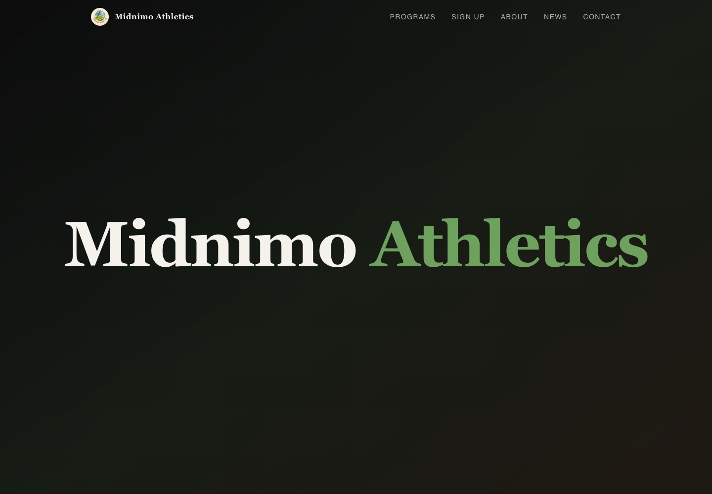
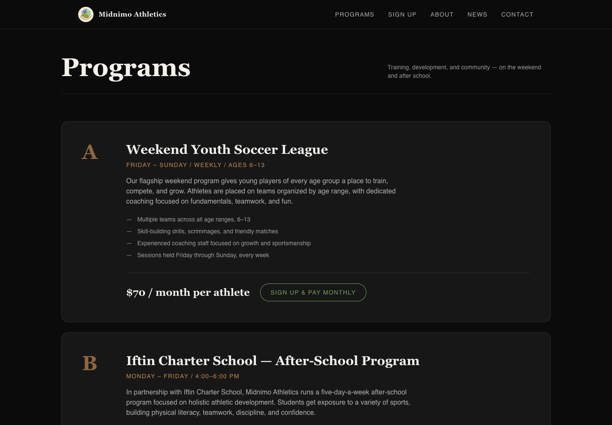
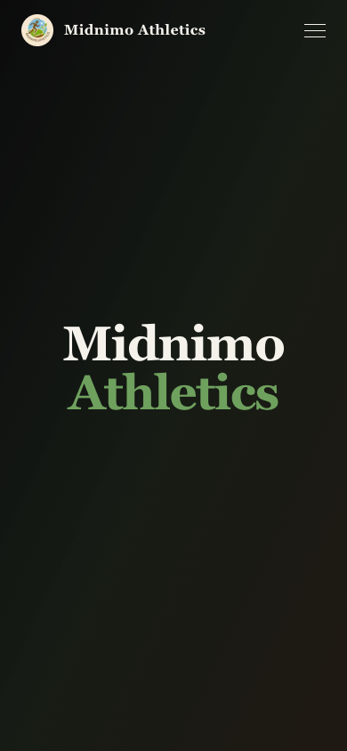
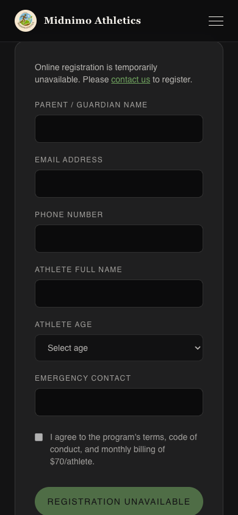
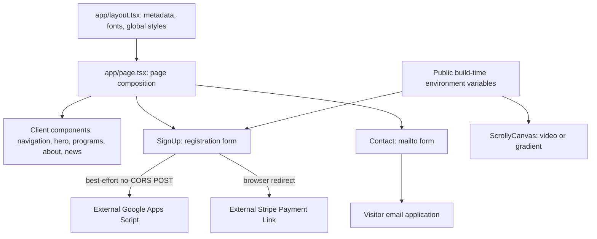

# Midnimo Athletics

A responsive website for a youth athletics program, helping families explore soccer and school programs, register an athlete, and reach the organizers. Built with Next.js, TypeScript, Tailwind CSS, and Framer Motion.

## Features

- Weekend Youth Soccer League for ages 6–13, with the site's advertised $70 monthly membership.
- After-school athletic development and summer-program information for the Iftin Charter School partnership.
- Responsive desktop/mobile navigation, scroll-linked hero animation, and animated program cards.
- Athlete-registration form with an optional Google Apps Script integration and Stripe hosted checkout link.
- About and news sections, plus a contact form that opens the visitor's email application.
- A gradient hero and disabled online registration when external integrations are unconfigured.

## Screenshots

Real local-browser captures of the default, unconfigured build. No real registrations or payments were submitted.




<p>
  
  
</p>

## Architecture



The App Router root page composes client components for animation and browser interactions. Despite its inherited name, `ScrollyCanvas.tsx` renders an HTML **video**, not a canvas or image sequence. Framer Motion tracks a 200vh section to animate its overlay. The site has no application database, authentication, API routes, or payment webhook in this repository.

```text
app/                    Root page, layout, metadata, and global CSS
components/             Navigation, hero, programs, signup, about, news, contact
lib/public-config.ts    Validated public integration URLs
public/images/          Brand logo
public/sequence/        Legacy starter documentation; not used by the current hero
docs/configuration.md   Environment variables and integration limitations
docs/screenshots/      Desktop and mobile browser captures
```

`Projects.tsx` is also an unused starter component; it is not rendered by `app/page.tsx`.

## Tech stack

| Layer | Technology |
| --- | --- |
| Application | Next.js 14 App Router, React 18 |
| Language | TypeScript with strict checking |
| Styling | Tailwind CSS 3, PostCSS, CSS custom properties |
| Animation | Framer Motion 11 |
| Typography | Fraunces and Inter through `next/font/google` |
| Integrations | Google Apps Script web app, Stripe Payment Links, `mailto:` |
| Tooling | npm lockfile; ESLint, TypeScript, and GitHub Actions in the CI improvement |

Exact dependency versions are recorded in `package-lock.json`. A separate security patch and CI improvement are tracked in [issue #4](https://github.com/kasimomar/midnimo-athletics/issues/4) and [issue #2](https://github.com/kasimomar/midnimo-athletics/issues/2).

## Local setup

Use Node.js 24 and npm. Install from the committed lockfile:

```bash
git clone https://github.com/kasimomar/midnimo-athletics.git
cd midnimo-athletics
npm ci
cp .env.example .env.local
npm run dev
```

Open [localhost:3000](http://localhost:3000). The default blank environment values let you explore the site without contacting registration or payment services. Optional URLs must be HTTPS; see [configuration and migration instructions](docs/configuration.md).

Production build and local preview:

```bash
npm run build
npm start
```

Google Fonts are downloaded during the build, so the build environment needs network access. Public environment values are embedded at build time; rebuild after changing deployment settings. Never place secrets in `NEXT_PUBLIC_*` variables.

## Quality checks and contribution workflow

The [CI pull request](https://github.com/kasimomar/midnimo-athletics/pull/5) adds these commands and runs them on pull requests and main pushes:

```bash
npm run lint
npm run typecheck
npm run build
```

Track each improvement with an issue, create a focused branch, and open a pull request referencing `Closes #<issue>`. Include relevant checks and screenshots for visible changes. Review deployment configuration before merging integration changes.

## Current limitations

- Registration uses an opaque `no-cors` request. It cannot confirm that the external sheet stored an athlete's information, and the existing flow continues to payment after a network error.
- Stripe checkout and registration are not reconciled. There is no webhook or verified payment/registration state.
- Contact opens `mailto:`; it does not send server-side email. News items are static placeholder updates.
- Content, schedule, and pricing are maintained in code. Verify them with the organization before publication.

## Future improvements

1. Replace best-effort registration with a validated server API, confirmed persistence, idempotent retries, and clear error recovery.
2. Reconcile Stripe webhooks with registrations and provide a verified confirmation flow.
3. Audit keyboard navigation, form labels, color contrast, and reduced-motion behavior; replace the time-based loading overlay with a less intrusive experience.
4. Add repeatable browser tests for navigation, registration configuration, and mocked checkout; run accessibility checks in CI.
5. Replace placeholder news with maintained content, optimize hero media, and measure page performance.
6. Keep dependencies patched and plan a supported Next.js upgrade; remove unused starter components/documentation when appropriate.
