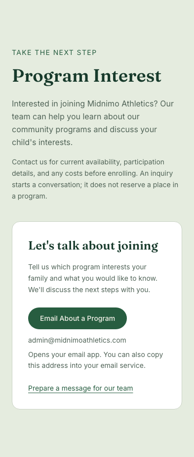
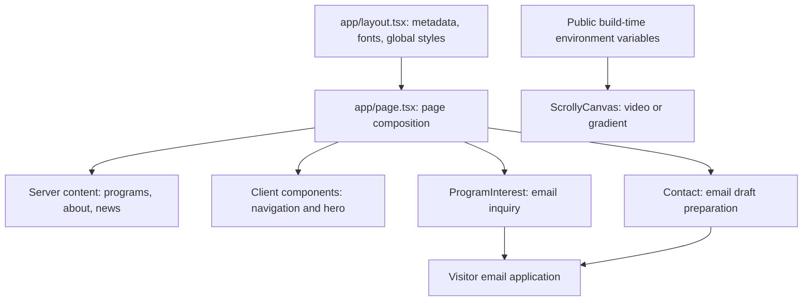

# Midnimo Athletics

A responsive website for Midnimo Athletics, a nonprofit welcoming all youth through sports, movement, and community. Families can explore soccer and school programs, learn about the mission, and contact the team about participation. Its sticky video hero and scroll-linked headline also showcase frontend interaction work. Built with Next.js, TypeScript, Tailwind CSS, and Framer Motion.

## Features

- Community Weekend Soccer for ages 6–13, with a program-interest route to discuss participation with the team.
- After-school athletic development and summer-program information for the Iftin Charter School partnership.
- A warm cream, sage, and forest-green theme that retains the existing video, sticky hero, page layout, cards, and typography.
- Responsive desktop/mobile navigation and a scroll-linked hero. Program, mission, news, and contact content render without entrance or hover movement.
- The hero uses a static background and readable, stationary text when reduced motion is requested, including preference changes while the page is open. The timed loading splash has been removed. Visitors can also hide a configured background video.
- A skip link, page landmarks, consecutive heading levels, visible keyboard focus, readable field boundaries, and autofill hints improve navigation and forms. Automated axe checks cover WCAG A/AA rules; these are not a claim of full conformance or a substitute for testing with screen-reader users.
- Mobile navigation exposes its expanded state, supports Tab and Escape, and closes when focus leaves or the layout switches to desktop.
- A short introduction to Coach Osman, Head Coach & CEO, based on the organization's supplied role and 20-plus years of community experience.
- Canonical URLs and search/social descriptions reflect the nonprofit identity; share previews use the existing logo.
- A nonprofit mission centered on a safe, welcoming place for all youth, including youth with autism already participating in the programs.
- Program inquiries and contact at `admin@midnimoathletics.com`; the contact form prepares an email draft for the visitor to review and send from their own email app.
- A gradient hero when video is unconfigured. Contact works independently of video settings; there is no online checkout or athlete-registration submission.

## Screenshots

Real browser captures of the nonprofit update with the gradient hero. No messages, registrations, or payments were submitted.


<p>
  
  
</p>

## Architecture



The App Router root page combines server-rendered content with client components for navigation, hero animation, and draft preparation. Despite its inherited name, `ScrollyCanvas.tsx` renders an HTML **video**, not a canvas or image sequence. Framer Motion tracks a 200vh section to animate its overlay. The site has no application database, authentication, API routes, or payment webhook in this repository.

```text
app/                    Root page, layout, metadata, and global CSS
components/             Navigation, hero, programs, interest, about, news, contact
lib/public-config.ts    Validated public hero-video URL
lib/contact.ts          Organization email and draft-link generation
public/images/          Brand logo
public/sequence/        Legacy starter documentation; not used by the current hero
docs/configuration.md   Environment variables and integration limitations
docs/screenshots/      Desktop and mobile browser captures
```

`Projects.tsx` is also an unused starter component; it is not rendered by `app/page.tsx`.

## Tech stack

| Layer | Technology |
| --- | --- |
| Application | Next.js 16 App Router, React 19 |
| Language | TypeScript with strict checking |
| Styling | Tailwind CSS 3, PostCSS, CSS custom properties |
| Animation | Framer Motion 13 |
| Typography | Fraunces and Inter through `next/font/google` |
| Integrations | Optional hero video, `mailto:` email drafts |
| Tooling | npm lockfile, ESLint, TypeScript, GitHub Actions |

Exact dependency versions are recorded in `package-lock.json`.

## Local setup

Use Node.js 24 and npm. Install from the committed lockfile:

```bash
git clone https://github.com/kasimomar/midnimo-athletics.git
cd midnimo-athletics
npm ci
cp .env.example .env.local
npm run dev
```

Open [localhost:3000](http://localhost:3000). Leave the optional video URL blank for the gradient hero. Video URLs must be HTTPS; see [configuration and migration instructions](docs/configuration.md).

Production build and local preview:

```bash
npm run build
npm start
```

Google Fonts are downloaded during the build, so the build environment needs network access. Public environment values are embedded at build time; rebuild after changing deployment settings. Never place secrets in `NEXT_PUBLIC_*` variables.

## Quality checks and contribution workflow

GitHub Actions runs dependency auditing and these checks on pull requests and pushes to main:

```bash
npm audit --audit-level=high
npm run lint
npm run typecheck
npm run build
```

Browser checks run against a fresh local production build on port 3100:

```bash
npx playwright install chromium
npm run test:e2e
E2E_MODE=configured npm run test:e2e
```

The default run checks blank video settings; the second checks configured video. Both cover desktop and mobile Chromium, navigation, nonprofit program-interest links, email-draft validation/encoding, keyboard landmarks and headings, reduced motion, and automated axe accessibility checks. Accessibility-tree checks verify exposed names/roles; a manual VoiceOver/NVDA session is still outstanding. The configured fixture deliberately supplies retired registration/payment variables to verify that they cannot restore checkout. External video is mocked; unexpected requests and all writes are blocked. Draft links are inspected without sending email. Run the two modes sequentially because each builds into `.next`. Builds still require access to Google Fonts.

CI runs both modes and saves screenshots, traces, and the HTML report on failure for seven days. To inspect a local report, run `npx playwright show-report`. Tests verify browser behavior and draft addresses, not email delivery. See the [Playwright web-server guide](https://playwright.dev/docs/test-webserver) for the runner configuration.

Track each improvement with an issue, create a focused branch, and open a pull request referencing `Closes #<issue>`. Include relevant checks and screenshots for visible changes. Review deployment configuration before merging integration changes.

## Current limitations

- Contact prepares `mailto:` drafts; it does not send server-side email or confirm delivery/enrollment. The published address was supplied by the organization; automated tests do not verify mailbox delivery.
- News items are static placeholder updates. Content and schedules are maintained in code and should be kept current with the organization.
- Participation costs and availability are discussed directly with the team. Seeking grants does not mean funding is secured or all programs are free.

## Future improvements

1. Add a confirmed-delivery inquiry service if the organization chooses one, with validation, spam protection, and clear error recovery.
2. Add family guidance, approved photography, and support/partnership information as the organization supplies and approves content.
3. Test with screen-reader users and broaden manual accessibility review, including error announcements when a real inquiry service is introduced.
4. Extend browser coverage with accessibility checks and additional browser engines.
5. Replace placeholder news with maintained content, optimize hero media, and measure page performance.
6. Keep dependencies patched and remove unused starter components/documentation when appropriate.
