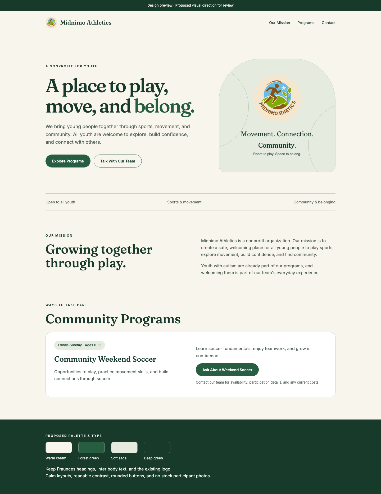
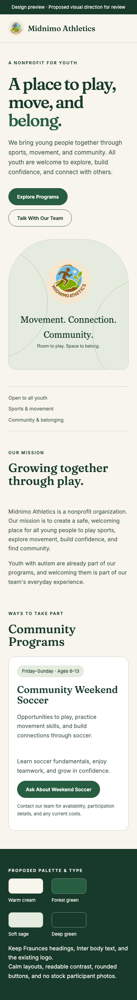

# Nonprofit visual direction — for review

Owner-selected plan item 13. This is a proposal; applying it across the live site (item 14) is awaiting the owner's review.

Keep the existing logo, Fraunces headings, and Inter body text. Use warm cream (#F8F5ED) for the main background, forest green (#275D40) for actions, soft sage (#E5ECDF) for supporting panels, and deep green (#173A2B) for text and occasional dark sections. Body copy uses #506357. Buttons have clear outlines and at least 44px targets. Use the real logo and simple shapes until approved program photographs are supplied.

The preview explores a calmer static opening, mission copy, and a program card. It does not introduce new program facts, funding claims, or participant photography.

## Selected content still pending

- **9 — real inquiry form:** Google Workspace is the receiving inbox. A website sending provider still needs to be chosen and configured. Resend was proposed; the current site continues to prepare email drafts and makes no delivery claim.
- **14 — apply visual style:** awaiting review of this preview.
- **16 — team:** the initial Coach Osman bio uses the owner's supplied name, Head Coach/CEO role, and more than 20 years working with underrepresented and underprivileged youth in San Diego. Full name, founding story, coaching approach, and any photos are awaiting further details.
- **17 — support:** deferred at the owner's request while the organization settles its identity. No support section or donation processing is introduced.

## Accessibility verification

The current implementation adds a skip link and page landmarks, corrects heading levels, increases form text/border contrast and mobile menu targets, exposes autofill hints and a persistent draft-status region, and removes entrance/hover movement from content sections. The decorative hero video can be hidden; reduced-motion visitors never load it. A constant dark veil keeps hero copy legible over media.

Playwright checks keyboard navigation, the accessible names/roles exposed in Chromium's accessibility tree, reduced-motion behavior, and axe WCAG A/AA rules on desktop/mobile with the menu open and closed. These automated checks do not replace a manual VoiceOver/NVDA session or usability testing with participants; those remain outstanding.
